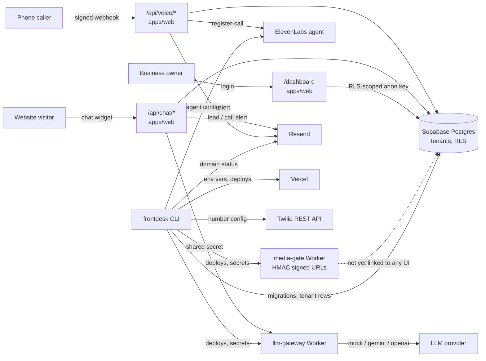

# frontdesk-kit

frontdesk-kit is an installer and verification toolkit for per-client AI front desk installs for US small businesses. Each install is a small website with an owner dashboard, a website chat assistant, and an AI phone receptionist, all backed by one shared multi-tenant database. The center of the project is the `frontdesk` CLI, which provisions a client install, checks it against a fixed set of gates, and prints a plain PASS/FAIL/SKIPPED report. The web app, the two Cloudflare Workers, and the voice routes exist so the CLI has a real system to install and check - this is not a CLI wrapping a mock backend.

This is an original project built for this repo. It does not copy or reference any other company's product, branding, or copy.

## Live demo

- Site: https://frontdesk-kit-rho.vercel.app
- Dashboard: https://frontdesk-kit-rho.vercel.app/dashboard/login
- Repo: https://github.com/arsalmurad/frontdesk-kit

## Architecture



## How it's built

Next.js App Router + TypeScript strict, npm workspaces, Supabase (Postgres, Auth, RLS, migrations), Cloudflare Workers (Wrangler), Twilio Voice (TwiML, signed webhooks), ElevenLabs Agents, Resend, GitHub Actions. The `frontdesk` CLI is TypeScript (commander), run as `npm run frontdesk -- <command>`.

```
apps/web/               site, /dashboard, API routes
packages/cli/           the frontdesk CLI
packages/config/        env contract, client config schema, vendor API clients
workers/llm-gateway/    only holder of the LLM key; providers: mock, gemini, openai
workers/media-gate/     HMAC-signed expiring URLs
clients/demo-plumbing/  the live demo's content
clients/_template/      blank client for new installs
supabase/migrations/    schema + RLS
.github/workflows/      ci.yml, deploy.yml
docs/                   RESEARCH.md, DESIGN_NOTES.md, RUNBOOK.md, ENV_CONTRACT.md, FALLBACK_TWIML.md
```

## No Twilio account

This was built with no Twilio account - trials are not available in the country this was built from. Every Twilio-facing part is built to Twilio's official docs (request signing, the phone number resource, TwiML) and proven with a local signature computation and a real deployed HTTP endpoint - never by calling the real Twilio REST API. `frontdesk verify` computes a valid and an invalid `X-Twilio-Signature` locally from a test auth token and checks the deployed voice route accepts one and rejects the other; `scripts/simulate-call.ts` does a fuller version of the same thing including database writes. Real number provisioning and a live phone call are listed as "Built to docs, not yet run live" below - they need a Twilio account this project does not have.

## Sample `frontdesk verify` output (from the live deployment)

```
$ npm run frontdesk -- verify --client demo-plumbing --url https://frontdesk-kit-rho.vercel.app

GATE                   STATUS   REASON
---------------------  -------  ----------------------------------------
1 typecheck+build      PASS     typecheck and build both exited 0
2 pages 200            PASS     /, /dashboard/login all returned 200
3 consent gate         PASS     403 without consent, 200 with consent
4 voice signature      PASS     valid signature accepted, unsigned and tampered both rejected with 403
5 twilio number        SKIPPED  no TWILIO_ACCOUNT_SID - this install has no Twilio account. The route itself is covered by gate 4 and scripts/simulate-call.ts.
6 elevenlabs privacy   PASS     first message, system prompt, and audio saving all match
7 resend domain        PASS     notify.arsalmurad.com is verified
8 secrets server-only  PASS     scanned .next/static, no server-only names or values found
9 RLS isolation        PASS     tenant A user could not read tenant B rows
10 media-gate          PASS     unsigned and expired both rejected, valid signature accepted
11 llm-gateway auth    PASS     401 without shared secret, 200 with it

Overall: PASS
```

Full report: `reports/demo-plumbing-2026-09-16.md`. Voice simulator output against the same live deployment: `reports/simulate-call-2026-09-16.txt`.

## Add a client in under 10 commands

```powershell
npm run frontdesk -- init --client acme-plumbing
# edit clients/acme-plumbing/config.json

vercel link                          # once per client, root directory = apps/web
npm run frontdesk -- provision --client acme-plumbing

vercel pull --yes --environment=production
vercel build --prod
vercel deploy --prebuilt --prod

npm run frontdesk -- verify --client acme-plumbing --url https://<deployed-url>
npx tsx scripts/simulate-call.ts --url https://<deployed-url> --client acme-plumbing
```

Full walkthrough, including the manual parts (the client's own Twilio account, the live call test, monthly `frontdesk doctor` checks): `docs/RUNBOOK.md`.

## Tested live / Built to docs, not yet run live

| Part | Status |
| --- | --- |
| Chat consent gate, chat answers grounded in client FAQ, out-of-scope lead capture | Tested live (real Gemini calls through the deployed `llm-gateway`) |
| Owner email notifications (new lead, call completed) | Tested live (Resend, delivered) |
| Voice webhook signature verification (valid/unsigned/tampered) | Tested live (`frontdesk verify` gate 4, `scripts/simulate-call.ts`) |
| Voice webhook -> ElevenLabs `register-call` handoff, TwiML with disclosure | Tested live |
| `consents` / `call_logs` rows written, status-callback updates them | Tested live |
| ElevenLabs agent provisioning (first message, prompt, audio saving off) | Tested live (provisioned and read back against the real agent) |
| RLS cross-tenant isolation | Tested live (throwaway tenants + real auth users, on the real database) |
| `media-gate` signed/expired/unsigned URLs | Tested live (deployed Worker) |
| `llm-gateway` shared-secret auth | Tested live (deployed Worker) |
| Secret-in-client-bundle scan | Tested live (scanned the real `.next/static` output) |
| CI (typecheck, lint, test, build, secret-scan) | Tested live (GitHub Actions, green) |
| `frontdesk provision`'s Supabase/Vercel/Worker steps | Tested live (real Supabase project, real Vercel project, real Workers) |
| Twilio phone number provisioning (`frontdesk provision` step 4) | Built to docs, not yet run live - no Twilio account |
| A real inbound phone call end to end | Built to docs, not yet run live - no Twilio account |
| `deploy.yml` (GitHub Actions -> Vercel + Workers) | Built to docs, pipeline confirmed to fail at exactly the missing-secret step; not yet run to completion - needs `VERCEL_TOKEN` and `CLOUDFLARE_API_TOKEN`, see below |
| ElevenLabs' own in-dashboard browser test widget | Not run - the equivalent real path (Twilio webhook -> `register-call` -> agent) was tested live instead |

## Why it's built this way

Short version: the wiring follows specific findings in `docs/RESEARCH.md` - the disclosure wording, why the assistant refuses to guess prices instead of answering confidently, why RLS policies wrap `auth.uid()` in a subquery, why owner notifications are synchronous. Full reasoning, plus every place a vendor's current docs differed from the original build plan (ElevenLabs' Twilio integration, Vercel's monorepo CLI usage, Next.js 16's `proxy.ts` rename): `docs/DESIGN_NOTES.md`.

## Local development

```powershell
npm install
npm run dev -w apps/web        # http://localhost:3000, client_id from .env.local's CLIENT_ID
npm test                       # vitest, vendor APIs mocked
npm run typecheck
npm run lint
```

One `.env.local` at the repo root (never committed) holds every credential; see `docs/ENV_CONTRACT.md` for the full list and which ones are optional. The deployed demo uses the test value `local-test-token-change-me` for `TWILIO_AUTH_TOKEN` - real enough to sign and verify requests with, not a real Twilio credential, which is what lets the voice route's signature verification be tested end to end without a Twilio account.

## What's still to do by hand

- Create a Vercel personal access token (Account Settings -> Tokens, needs a browser) and `gh secret set VERCEL_TOKEN` on this repo, so `deploy.yml` can deploy. `VERCEL_ORG_ID` and `VERCEL_PROJECT_ID` are already set.
- Create a Cloudflare API token (My Profile -> API Tokens, needs a browser, "Edit Cloudflare Workers" template) and `gh secret set CLOUDFLARE_API_TOKEN`, so `deploy.yml` can deploy the Workers. `CLOUDFLARE_ACCOUNT_ID` is already set.
- A real Twilio account for any client that wants live phone calls - see `docs/RUNBOOK.md` section 5.
- The live phone call test itself (`docs/RUNBOOK.md` section 8), once a Twilio account exists.
