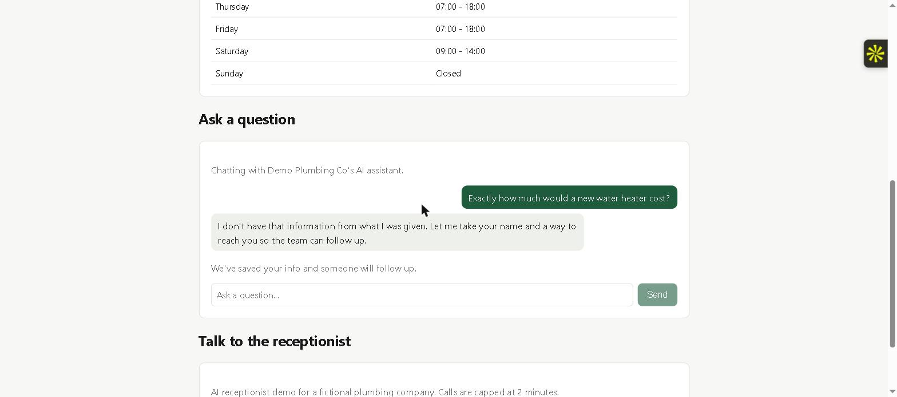
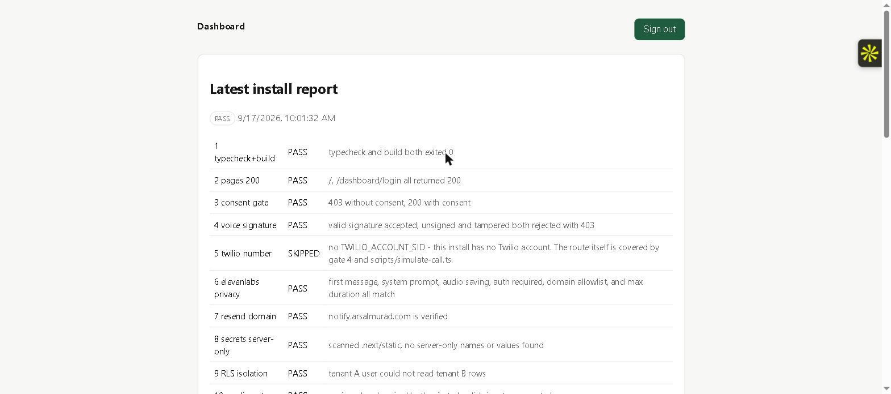
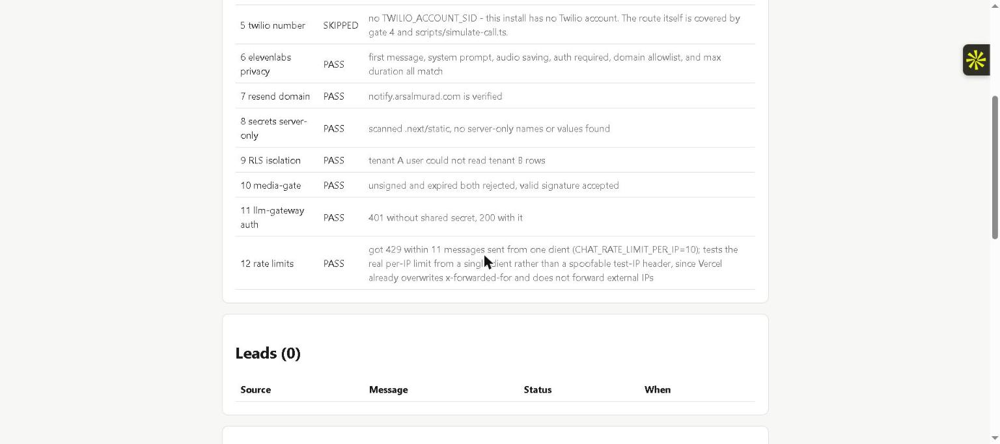
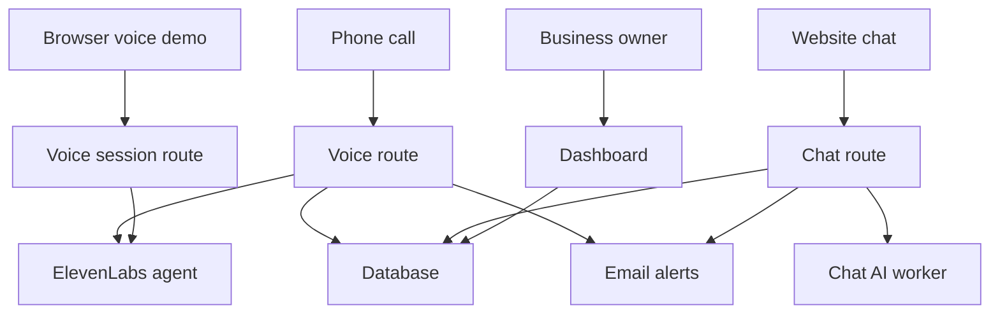

# AI Receptionist Installer

[](https://github.com/arsalmurad/ai-receptionist-installer/actions/workflows/ci.yml)
[](LICENSE)

Who it's for: an agency or contractor who installs the same AI receptionist (website, chat, phone agent) for many small businesses.

What it does: one command sets up a new business, a second command checks the live install against 13 pass/fail checks, and a third rechecks live installs later for anything that broke. Nine of those checks also run standalone against any AI receptionist install (not just one built from this repo) with `frontdesk check --target` - see "Check any install" below.

Why: when you run 20 of these, the failures are quiet (a webhook pointing at an old URL, a key leaking into browser code, one client seeing another's data). This finds them before the client does.

```powershell
npm run frontdesk -- init --client acme-plumbing
npm run frontdesk -- provision --client acme-plumbing
npm run frontdesk -- verify --client acme-plumbing --url https://<deployed-url>
```

A trimmed sample of what `verify` prints against the live demo below:

```
GATE                   STATUS   REASON
---------------------  -------  ----------------------------------------
1 typecheck+build      PASS     typecheck and build both exited 0
6 elevenlabs privacy   PASS     first message, system prompt, audio saving, auth required, domain allowlist, max duration, turn eagerness, turn timeout, and skip_turn all match
9 RLS isolation        PASS     tenant A user could not read tenant B rows
12 rate limits         PASS     got 429 within 11 messages sent under an isolated verify-only test key
13 SEO basics          PASS     title, meta description, canonical, sitemap.xml, robots.txt, and LocalBusiness JSON-LD all present

Overall: PASS
```

The live site linked below is not the product. It's a fake client, a made-up plumbing company, that this tool installed and checked, so you can see what an install looks like. A slim banner on every page of that site links to `/about-this-demo`, which explains this again in context and shows its latest verify report.

## The problem

Small businesses miss calls and website questions after hours. An AI receptionist can answer them, but each business needs its own setup: a website, a chat assistant, a phone line, a database, and email alerts to the owner. When that setup is done by hand, things break quietly. A phone webhook points at an address from three months ago. A secret leaks into the website's code. One business can see another business's data. The owner usually finds out from an angry customer, not from a dashboard.

## What this does

- It sets up a new business's install in a few commands.
- It then runs 13 automated checks that prove the install is safe and working, and prints a pass or fail report.
- Later, it rechecks live installs for anything that has drifted since setup.
- Nine of those 13 checks also work standalone against any AI receptionist install, not just one this tool set up - see "Check any install".

## Try it in 2 minutes

- Website: https://ai-receptionist-installer.vercel.app
- Ask the chat a question about hours or services. (This runs on Gemini's free tier, which caps out at 20 questions a day across every visitor. If it says it's reached today's limit, that's real, not a bug - try again tomorrow.)
- Ask it a price it doesn't list. It won't guess. It takes your details instead so someone can follow up.
- Try "Talk to the receptionist" to speak with the same AI agent in your browser, no phone call needed.
- Dashboard (leads, chats, calls): login available on request.

The chat declining to guess a price and taking details instead:



The owner dashboard:



A `frontdesk verify` run, visible on the dashboard:



## What a business gets

- A website with its hours, services, and service area.
- A chat assistant on that website that answers from the business's own information.
- An AI phone receptionist that answers calls, or, until a phone line is connected, the same agent reachable in the browser.
- An owner dashboard showing leads, chats, calls, and the latest safety check.

## The checks

`frontdesk verify` runs all 13 against a live install and prints PASS, FAIL, or SKIPPED (skipped means a dependency, like a phone account, isn't set up yet, not that the check passed). Rows marked "portable" also run standalone via `frontdesk check --target` against any install, not only ones built from this repo - see "Check any install".

| # | Check | What it proves | Portable |
| --- | --- | --- | --- |
| 1 | Code builds and typechecks | Nothing obviously broken went live | |
| 2 | Key pages load | The website and the dashboard login page are actually reachable | yes |
| 3 | Chat consent gate | The chat assistant won't talk before showing its AI disclosure | yes |
| 4 | Phone webhook signature | A stranger can't send fake calls to the phone line | yes |
| 5 | Phone number configuration | The phone number points at this business's install, not an old one | yes |
| 6 | Voice agent settings | The phone and browser voice agent require a signed session, restrict which website can use them, cap call length, and don't record audio | yes |
| 7 | Email domain status | The domain that sends owner alerts is still verified, so alerts aren't silently failing | yes |
| 8 | Secret scan | No passwords or keys end up in the website code sent to visitors' browsers | yes |
| 9 | Data isolation | One business can't see another business's leads, chats, or calls | |
| 10 | Shared link signing | A shared file link can't be guessed or reused after it expires | |
| 11 | AI gateway authentication | Only this website can use the AI behind the chat assistant, not anyone who finds its address | |
| 12 | Rate limits | A stranger can't run up the bill by hammering the chat assistant | yes |
| 13 | SEO basics | The site has a title, meta description, canonical tag, sitemap, robots.txt, and valid LocalBusiness structured data | yes |

Sample output, from the live install:

```
$ npm run frontdesk -- verify --client demo-plumbing --url https://ai-receptionist-installer.vercel.app

GATE                   STATUS   REASON
---------------------  -------  ----------------------------------------
1 typecheck+build      PASS     typecheck and build both exited 0
2 pages 200            PASS     /, /dashboard/login all returned 200
3 consent gate         PASS     403 without consent, 200 with consent
4 voice signature      PASS     valid signature accepted, unsigned and tampered both rejected with 403
5 twilio number        SKIPPED  no TWILIO_ACCOUNT_SID - this install has no Twilio account
6 elevenlabs privacy   PASS     first message, system prompt, audio saving, auth required, domain allowlist, max duration, turn eagerness, turn timeout, and skip_turn all match
7 resend domain        PASS     notify.arsalmurad.com is verified
8 secrets server-only  PASS     scanned .next/static, no server-only names or values found
9 RLS isolation        PASS     tenant A user could not read tenant B rows
10 media-gate          PASS     unsigned and expired both rejected, valid signature accepted
11 llm-gateway auth    PASS     401 without shared secret, 200 with it (not 401, so the secret was accepted)
12 rate limits         PASS     got 429 within 11 messages sent under an isolated verify-only test key (CHAT_RATE_LIMIT_PER_IP=10); exercises the real public per-IP limit without touching any real visitor's window or the shared daily quota
13 SEO basics          PASS     title and meta description present, canonical present, sitemap.xml and robots.txt reachable, JSON-LD parses with @type "LocalBusiness" (title differs between / and /about-this-demo)

Overall: PASS
```

Gate 3 used to be able to FAIL here if `verify` had already been run enough times that day to spend the shared daily chat quota - fixed by giving `verify` its own `VERIFY_TOKEN`-authenticated rate-limit namespace and a mock-provider reply, so it never competes with real visitors for that budget. See `docs/DESIGN_NOTES.md`.

Full report: `reports/demo-plumbing-2026-09-19.md`. The same 9 portable gates, run standalone with `frontdesk check --target`: `reports/live-demo-plumbing-2026-09-19.md`. The phone webhook simulator's output against the same install: `reports/simulate-call-2026-09-17.txt`.

## Known limits

Voice agents can still mishear in a noisy room. What this install does about it:

- The agent's turn-taking is set to patient, and it waits longer before deciding a caller has stopped talking, so a stray noise is less likely to be treated as a finished turn.
- The system prompt tells the agent to skip fragmentary, off-topic, or unclear input instead of answering it, and to say so once if it happens twice in a row.
- The browser voice widget shows whether it's listening or the agent is speaking, and has a mute button and a text input, so a user in a noisy room can mute or type instead of relying on the microphone.
- ElevenLabs' widget and SDK do not currently expose a way to pass browser microphone constraints (echo cancellation, noise suppression, automatic gain control) directly, so noise handling on the input side is whatever the browser does by default. See `docs/DESIGN_NOTES.md`.

This has not been tested on a real phone line yet, only in the browser - see "What's actually been run, and what hasn't" below.

## Check any install

Nine of the 13 checks only need a live URL plus whichever vendor credentials you have - they work against any AI receptionist install that follows this project's conventions (the consent-gate contract, an ElevenLabs voice agent, a Twilio voice webhook), not only ones this repo provisioned. This is the part you can use on day one without adopting the whole stack.

```powershell
npm run frontdesk -- check --target path/to/target-config.json
```

`examples/target-config.example.json` shows every field. Every credential block is optional - the command skips whatever it can't test instead of failing:

```json
{
  "name": "example-client",
  "baseUrl": "https://example-client.example.com",
  "twilio": { "authToken": "..." },
  "elevenLabs": { "apiKey": "...", "agentId": "..." },
  "resend": { "apiKey": "...", "fromDomain": "..." }
}
```

With just `name` and `baseUrl`, it still runs pages-load, consent-gate, rate-limit, and SEO checks - the ones that need no credentials at all. Add whichever vendor credentials you have for the rest. The voice agent check is structural (audio saving off, auth required, sane call cap, documented turn-taking values) rather than an exact match against one business's config, since a target install's content is unknown - see `docs/DESIGN_NOTES.md`.

## SEO

Every client site generates its own SEO metadata from `clients/<id>/config.json` at build time - no per-client hand-editing:

- Title, meta description (from `seoDescription`, or generated from the business name and service area if unset), canonical tag, Open Graph and Twitter tags.
- `sitemap.xml` and `robots.txt` (Next.js's built-in conventions, `apps/web/app/sitemap.ts` and `apps/web/app/robots.ts`).
- LocalBusiness JSON-LD (name, phone, service area, hours, and address if the client config has one) - checked against schema.org's LocalBusiness docs and Google's structured data guidelines for what's required (`name`, `address`) versus recommended (`telephone`, `url`, `openingHoursSpecification`).

Gate 13 proves all of it is actually present and parses, both in `frontdesk verify` and `frontdesk check --target`.

The one exception is this repo's own demo install: `clientConfig.demo: true` (set on `clients/demo-plumbing/config.json` only) makes every page noindex except `/about-this-demo`, which stays indexable, because the rest of the site is a fictional business and has no business ranking anywhere. A real client's config leaves `demo` unset (or `false`) and indexes normally.

## Architecture



Three ways in (a phone call, the website chat, or the browser voice demo) and one way for the owner to see what happened (the dashboard). Everything shares one database, scoped per business.

## Phone provider

The phone path is built for Twilio, the provider this kind of install normally uses. No other phone provider is wired in. The same AI agent is reachable today in the browser, above. A real inbound phone call hasn't been run because I have no Twilio account. Everything that can be proven without a phone account (webhook signature checking, the handoff to the agent, database writes) is proven live. See "Tested live" below.

## How it's built

Next.js App Router, TypeScript strict, npm workspaces, Supabase (Postgres, Auth, RLS, migrations), Cloudflare Workers, Twilio Voice, ElevenLabs Agents, Resend, GitHub Actions. The CLI is TypeScript on commander, run as `npm run frontdesk -- <command>`.

```
apps/web/               site, /dashboard, API routes, sitemap.ts, robots.ts
packages/cli/           the frontdesk CLI (init, provision, verify, check, doctor)
packages/config/        env contract, client config schema, SEO, target config, vendor API clients
workers/llm-gateway/    only holder of the LLM key; providers: mock, gemini, openai
workers/media-gate/     HMAC-signed expiring URLs (built and tested, not yet wired to a UI)
clients/demo-plumbing/  the live demo's content
clients/_template/      blank client for new installs
examples/               target-config.example.json, for `frontdesk check`
scripts/                demo.ts, simulate-call.ts, secret-scan.ts, voice-noise-test.ts
supabase/migrations/    schema, RLS, rate limits
.github/workflows/      ci.yml, deploy.yml
.github/ISSUE_TEMPLATE/ bug_report.md, feature_request.md
docs/                   RESEARCH.md, DESIGN_NOTES.md, RUNBOOK.md, ENV_CONTRACT.md, FALLBACK_TWIML.md
```

## Adding a client

```powershell
npm run frontdesk -- init --client acme-plumbing
# edit clients/acme-plumbing/config.json

vercel link                          # once per client, root directory = apps/web
npm run frontdesk -- provision --client acme-plumbing

vercel pull --yes --environment=production
vercel build --prod
vercel deploy --prebuilt --prod

npm run frontdesk -- verify --client acme-plumbing --url https://<deployed-url>
npx tsx scripts/simulate-call.ts --url https://<deployed-url> --client acme-plumbing
```

That's the whole loop, ten commands, two of which are edits. The parts that can't be scripted (the client's own Twilio account, the live call test, walking the client through the dashboard, the monthly `frontdesk doctor` check) are in `docs/RUNBOOK.md`.

## Local development

No external accounts needed - starts a local Supabase instance (needs Docker running), the mock LLM provider, and the web app with seeded demo data:

```powershell
npm install
npm run demo
```

Then open http://localhost:3000. What's on: the website, the chat assistant (mock provider - deterministic FAQ-matched answers, not a real LLM call), the dashboard, and `npm run frontdesk -- verify --client demo-plumbing` (vendor-gated gates report SKIPPED instead of FAIL, same as any install missing those credentials). What's off: voice ("Talk to the receptionist" explains what it needs instead of failing), real Twilio/Resend/ElevenLabs.

Read-only demo dashboard login (cannot change anything - see below):

```
viewer@demo.local / ViewOnly-Demo-2026!
```

This account has the `viewer` role in `tenant_members`. Every table's row-level security policy only grants `select` to authenticated members regardless of role - there is no `insert`/`update`/`delete` policy for the authenticated role on any table, only for the service role used by server routes - so a viewer (or any signed-in member) is already unable to write at the database level, not just hidden from write buttons in the UI. `packages/cli/src/commands/verify.ts`'s RLS gate proves cross-tenant isolation the same way; the local Supabase instance started by `npm run demo` can be used to confirm a viewer-role session specifically gets rejected on a write, by attempting one directly against the local API with the viewer's session token.

To run against a real deployment instead of demo mode, copy `.env.example` to `.env.local` at the repo root and fill in real values:

```powershell
npm run dev -w apps/web        # http://localhost:3000, client from .env.local's CLIENT_ID
npm test                       # vitest, vendor APIs mocked
npm run typecheck
npm run lint
```

`.env.local` is never committed. `docs/ENV_CONTRACT.md` lists every variable and which are optional. The deployed demo's `TWILIO_AUTH_TOKEN` is a random value I generated, not a real Twilio credential, and it's never printed or committed. It's real enough to sign and verify requests against, which is what lets the phone webhook's signature check be tested end to end without a Twilio account.

## What's actually been run, and what hasn't

Tested against the live install, not just written and assumed to work:

- Chat: consent gate, FAQ-grounded answers through a real Gemini call, out-of-scope questions correctly turning into a captured lead instead of a guess
- Owner email notifications for a new lead and a completed call, confirmed delivered in Resend
- Phone webhook signature verification, valid, unsigned, and tampered requests all behave correctly
- The Twilio webhook to ElevenLabs handoff, including the disclosure line in the returned call instructions
- Database rows for consent and calls being written, and the status update route updating them
- ElevenLabs agent provisioning, first message, system prompt, audio saving, signed-session auth, domain allowlist, and max call duration all read back correctly from the real agent
- Data isolation between businesses, using throwaway test businesses and real accounts against the real database
- The shared file link signing worker's signed, expired, and unsigned URL handling, on the deployed worker
- The chat AI worker's shared-secret check, on the deployed worker
- A scan of the actual built website code for leaked server-only secrets
- Chat, phone webhook, and browser voice rate limits, all against the real deployed limits
- CI (typecheck, lint, test, build, secret scan) and the deploy pipeline (Vercel and both workers), both green on GitHub Actions
- `frontdesk provision`'s database, Vercel, and worker steps, against the real project and the real deployment
- `frontdesk check --target` against the live deployed site, standalone
- `npm run demo` end to end: local Supabase, the local mock LLM gateway, the viewer login, and voice correctly reporting itself disabled. Chat responses in this mode were re-measured directly (worker, API route, and the real browser via resource timing) at under half a second each - see `docs/DESIGN_NOTES.md` for how an earlier 15-20s reading was chased down and didn't reproduce.

Built to the vendor docs but not run live, because they need things I don't have:

- Twilio phone number provisioning (`frontdesk provision` step 4), no Twilio account
- An actual inbound phone call, start to finish, same reason

## Why it's built this way

The wiring follows specific findings in `docs/RESEARCH.md`, not habit: the disclosure line's exact wording, why the assistant refuses to guess at a price instead of answering confidently, why the database's row-level security wraps the current user check in a subquery, why owner notifications fire immediately instead of going through a queue. `docs/DESIGN_NOTES.md` has the full reasoning, plus every place a vendor's current docs turned out to disagree with how I'd originally planned to build something.

## What's left to do by hand

- A real Twilio account for any client that wants live phone calls, and the manual step in `docs/FALLBACK_TWIML.md`, see `docs/RUNBOOK.md` section 5.
- The live phone call test (`docs/RUNBOOK.md` section 8), once a Twilio account exists.

Everything the deploy pipeline needs is already set up, so nothing is blocking a push to `main` from deploying.

## Contributing

See `CONTRIBUTING.md` for running it locally, adding a check, and adding a client. `CODE_OF_CONDUCT.md` applies to all project spaces. Bug and feature issue templates, and a pull request template, are under `.github/`.

## License

MIT - see `LICENSE`. Copyright Muhammad Arsal Murad.
