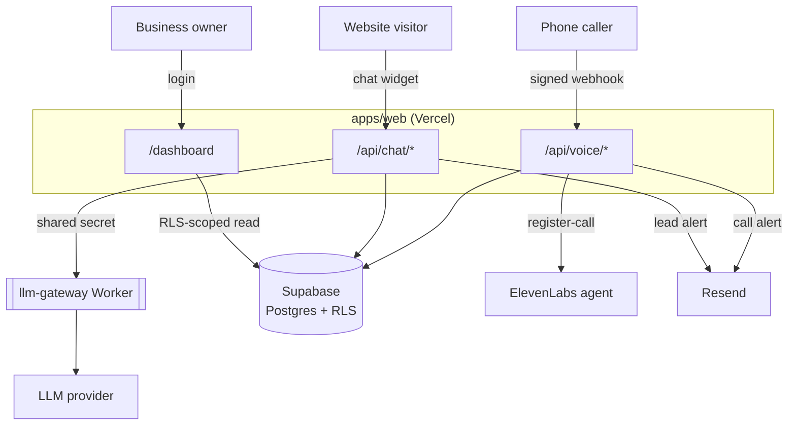
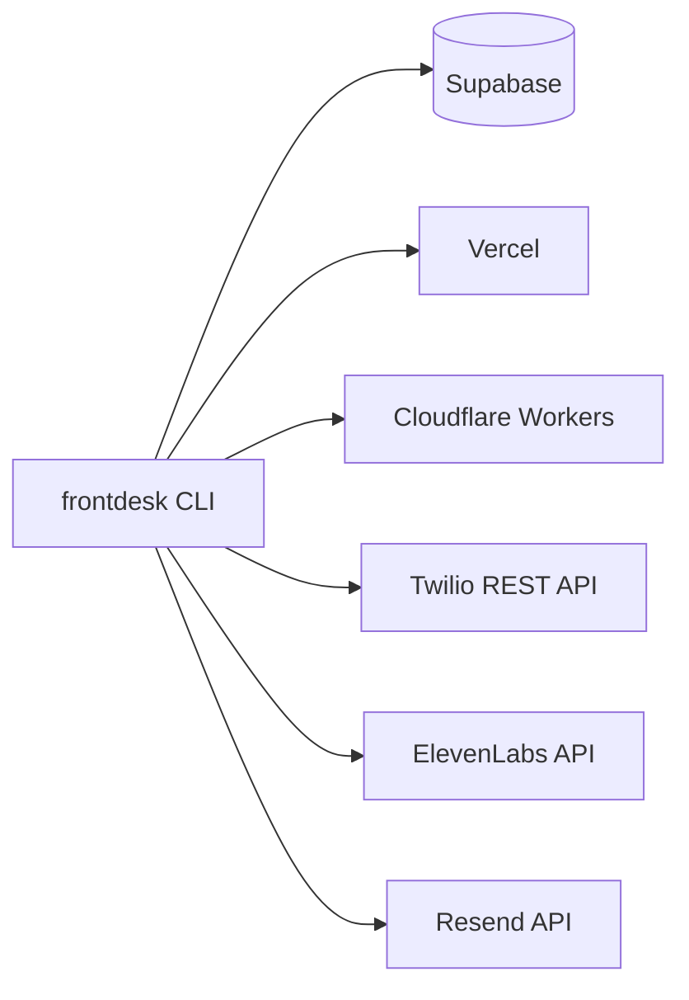

# frontdesk-kit

Small businesses that adopt an AI receptionist usually find out what's broken from an angry customer, not from a dashboard. frontdesk-kit is my attempt at the opposite: an installer and verification toolkit for AI front desk installs, where every install — a small business website, an owner dashboard, a chat assistant, and a phone receptionist — gets checked against the same fixed set of gates before anyone calls it done.

The `frontdesk` CLI is the actual point of the project. `init` scaffolds a client, `provision` wires up Supabase, Vercel, the Cloudflare Workers, Twilio, and ElevenLabs, `verify` runs eleven checks against a live deployment and prints PASS/FAIL/SKIPPED, and `doctor` catches drift later (a webhook still pointing at last month's URL, a domain that stopped verifying). The web app and the two Workers aren't a demo shell around the CLI — they're the real system the CLI installs and checks, which is why `verify` can fail for real reasons instead of always saying yes.

Everything in this repo — the code, the copy, the fictional "Demo Plumbing Co" — is original, written for this project.

## Live demo

- Site: https://frontdesk-kit-rho.vercel.app
- Dashboard: https://frontdesk-kit-rho.vercel.app/dashboard/login
- Repo: https://github.com/arsalmurad/frontdesk-kit

## Architecture

What happens when someone actually calls or chats in:



And separately, what `frontdesk provision` actually touches:



## How it's built

Next.js App Router, TypeScript strict, npm workspaces, Supabase (Postgres, Auth, RLS, migrations), Cloudflare Workers, Twilio Voice, ElevenLabs Agents, Resend, GitHub Actions. The CLI is TypeScript on commander, run as `npm run frontdesk -- <command>`.

```
apps/web/               site, /dashboard, API routes
packages/cli/           the frontdesk CLI
packages/config/        env contract, client config schema, vendor API clients
workers/llm-gateway/    only holder of the LLM key; providers: mock, gemini, openai
workers/media-gate/     HMAC-signed expiring URLs (built and tested, not yet wired to a UI)
clients/demo-plumbing/  the live demo's content
clients/_template/      blank client for new installs
supabase/migrations/    schema + RLS
.github/workflows/      ci.yml, deploy.yml
docs/                   RESEARCH.md, DESIGN_NOTES.md, RUNBOOK.md, ENV_CONTRACT.md, FALLBACK_TWIML.md
```

## No Twilio account

I built this with no Twilio account — trials aren't offered in the country I'm in. Every Twilio-facing piece is built straight from Twilio's docs (request signing, the phone number resource, TwiML) and proven without ever calling Twilio's real API: `frontdesk verify` computes a valid and an invalid `X-Twilio-Signature` locally from a test auth token and checks that the deployed voice route accepts one and rejects the other, and `scripts/simulate-call.ts` does a fuller version of the same thing, including checking that the right database rows get written. Real number provisioning and an actual phone call are the two things in this repo that are built to the docs but not run live — see the list at the bottom.

## Sample `frontdesk verify` output (from the live deployment)

```
$ npm run frontdesk -- verify --client demo-plumbing --url https://frontdesk-kit-rho.vercel.app

GATE                   STATUS   REASON
---------------------  -------  ----------------------------------------
1 typecheck+build      PASS     typecheck and build both exited 0
2 pages 200            PASS     /, /dashboard/login all returned 200
3 consent gate         PASS     403 without consent, 200 with consent
4 voice signature      PASS     valid signature accepted, unsigned and tampered both rejected with 403
5 twilio number        SKIPPED  no TWILIO_ACCOUNT_SID - this install has no Twilio account
6 elevenlabs privacy   PASS     first message, system prompt, and audio saving all match
7 resend domain        PASS     notify.arsalmurad.com is verified
8 secrets server-only  PASS     scanned .next/static, no server-only names or values found
9 RLS isolation        PASS     tenant A user could not read tenant B rows
10 media-gate          PASS     unsigned and expired both rejected, valid signature accepted
11 llm-gateway auth    PASS     401 without shared secret, 200 with it

Overall: PASS
```

Full report: `reports/demo-plumbing-2026-09-16.md`. The voice simulator's output against the same deployment is in `reports/simulate-call-2026-09-16.txt`.

## Adding a client

```powershell
npm run frontdesk -- init --client acme-plumbing
# edit clients/acme-plumbing/config.json

vercel link                          # once per client, root directory = apps/web
npm run frontdesk -- provision --client acme-plumbing

vercel pull --yes --environment=production
vercel build --prod
vercel deploy --prebuilt --prod

npm run frontdesk -- verify --client acme-plumbing --url https://<deployed-url>
npx tsx scripts/simulate-call.ts --url https://<deployed-url> --client acme-plumbing
```

That's the whole loop, ten commands, two of which are edits. The parts that can't be scripted — the client's own Twilio account, the live call test, walking the client through the dashboard, the monthly `frontdesk doctor` check — are in `docs/RUNBOOK.md`.

## What's actually been run, and what hasn't

Tested against the live deployment, not just written and assumed to work:

- Chat: consent gate, FAQ-grounded answers through a real Gemini call, out-of-scope questions correctly turning into a captured lead instead of a guess
- Owner email notifications for a new lead and a completed call, confirmed delivered in Resend
- Voice webhook signature verification — valid, unsigned, and tampered requests all behave correctly
- The Twilio webhook to ElevenLabs `register-call` handoff, including the disclosure line in the returned TwiML
- `consents` and `call_logs` rows being written, and the status-callback route updating them
- ElevenLabs agent provisioning — first message, system prompt, and audio-saving all read back correctly from the real agent
- RLS cross-tenant isolation, using throwaway tenants and real auth users against the real database
- `media-gate`'s signed, expired, and unsigned URL handling on the deployed Worker
- `llm-gateway`'s shared-secret check on the deployed Worker
- A scan of the actual built `.next/static` output for leaked server-only secrets
- CI (typecheck, lint, test, build, secret-scan) and `deploy.yml` (Vercel + both Workers), both green on GitHub Actions
- `frontdesk provision`'s Supabase, Vercel, and Worker steps, against the real project and the real deployment

Built to the vendor docs but not run live, because they need things I don't have:

- Twilio phone number provisioning (`frontdesk provision` step 4) — no Twilio account
- An actual inbound phone call, start to finish — same reason
- ElevenLabs' own in-dashboard browser test widget — the equivalent real path, an actual Twilio webhook handed off through `register-call`, was tested live instead, which seemed like the more meaningful check

## Why it's built this way

The wiring follows specific findings in `docs/RESEARCH.md`, not habit: the disclosure line's exact wording, why the assistant refuses to guess at a price instead of answering confidently, why the RLS policies wrap `auth.uid()` in a subquery, why owner notifications fire synchronously instead of going through a queue. `docs/DESIGN_NOTES.md` has the full reasoning, plus every place a vendor's current docs turned out to disagree with how I'd originally planned to build something — ElevenLabs' Twilio integration, how the Vercel CLI has to be invoked in a monorepo, Next.js 16 renaming `middleware.ts` to `proxy.ts` mid-build.

## Local development

```powershell
npm install
npm run dev -w apps/web        # http://localhost:3000, client from .env.local's CLIENT_ID
npm test                       # vitest, vendor APIs mocked
npm run typecheck
npm run lint
```

One `.env.local` at the repo root holds every credential and is never committed — `docs/ENV_CONTRACT.md` lists all of them and which are optional. The deployed demo's `TWILIO_AUTH_TOKEN` is the literal string `local-test-token-change-me`: real enough to sign and verify requests against, not a real Twilio credential, which is exactly what lets signature verification be tested end to end without a Twilio account.

## What's left to do by hand

- A real Twilio account for any client that wants live phone calls, and the manual TwiML Bin step in `docs/FALLBACK_TWIML.md` — see `docs/RUNBOOK.md` section 5.
- The live phone call test (`docs/RUNBOOK.md` section 8), once a Twilio account exists.

`VERCEL_TOKEN`, `VERCEL_ORG_ID`, `VERCEL_PROJECT_ID`, `CLOUDFLARE_API_TOKEN`, and `CLOUDFLARE_ACCOUNT_ID` are already set as GitHub secrets and `deploy.yml` is green, so there's nothing else blocking a push to `main` from deploying.
