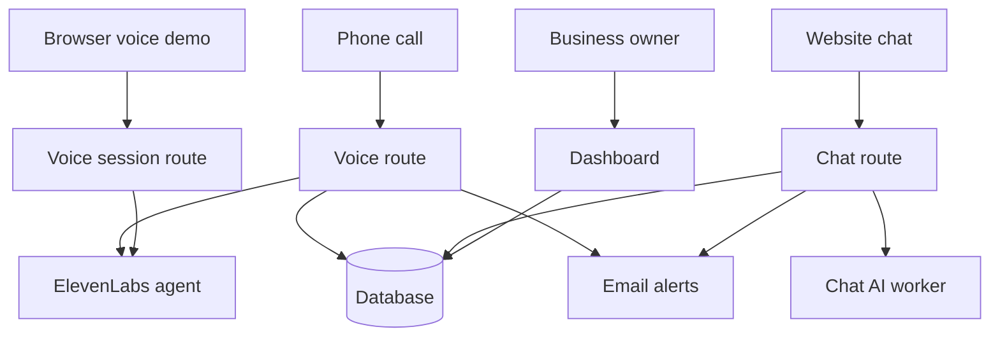

# AI Receptionist Installer

This sets up an AI chat assistant and phone receptionist for a small business, then proves the install actually works with 12 automated checks.

## The problem

Small businesses miss calls and website questions after hours. An AI receptionist can answer them, but each business needs its own setup: a website, a chat assistant, a phone line, a database, and email alerts to the owner. When that setup is done by hand, things break quietly. A phone webhook points at an address from three months ago. A secret leaks into the website's code. One business can see another business's data. The owner usually finds out from an angry customer, not from a dashboard.

## What this does

- It sets up a new business's install in a few commands.
- It then runs 12 automated checks that prove the install is safe and working, and prints a pass or fail report.
- Later, it rechecks live installs for anything that has drifted since setup.

## Try it in 2 minutes

- Website: https://frontdesk-kit-rho.vercel.app
- Ask the chat a question about hours or services.
- Ask it a price it doesn't list. It won't guess. It takes your details instead so someone can follow up.
- Try "Talk to the receptionist" to speak with the same AI agent in your browser, no phone call needed.
- Dashboard (leads, chats, calls): login available on request.

## What a business gets

- A website with its hours, services, and service area.
- A chat assistant on that website that answers from the business's own information.
- An AI phone receptionist that answers calls, or, until a phone line is connected, the same agent reachable in the browser.
- An owner dashboard showing leads, chats, calls, and the latest safety check.

## The checks

`frontdesk verify` runs all 12 against a live install and prints PASS, FAIL, or SKIPPED (skipped means a dependency, like a phone account, isn't set up yet, not that the check passed).

| # | Check | What it proves |
| --- | --- | --- |
| 1 | Code builds and typechecks | Nothing obviously broken went live |
| 2 | Key pages load | The website and the dashboard login page are actually reachable |
| 3 | Chat consent gate | The chat assistant won't talk before showing its AI disclosure |
| 4 | Phone webhook signature | A stranger can't send fake calls to the phone line |
| 5 | Phone number configuration | The phone number points at this business's install, not an old one |
| 6 | Voice agent settings | The phone and browser voice agent require a signed session, restrict which website can use them, cap call length, and don't record audio |
| 7 | Email domain status | The domain that sends owner alerts is still verified, so alerts aren't silently failing |
| 8 | Secret scan | No passwords or keys end up in the website code sent to visitors' browsers |
| 9 | Data isolation | One business can't see another business's leads, chats, or calls |
| 10 | Shared link signing | A shared file link can't be guessed or reused after it expires |
| 11 | AI gateway authentication | Only this website can use the AI behind the chat assistant, not anyone who finds its address |
| 12 | Rate limits | A stranger can't run up the bill by hammering the chat assistant |

Sample output, from the live install:

```
$ npm run frontdesk -- verify --client demo-plumbing --url https://frontdesk-kit-rho.vercel.app

GATE                   STATUS   REASON
---------------------  -------  ----------------------------------------
1 typecheck+build      PASS     typecheck and build both exited 0
2 pages 200            PASS     /, /dashboard/login all returned 200
3 consent gate         PASS     403 without consent, 200 with consent
4 voice signature      PASS     valid signature accepted, unsigned and tampered both rejected with 403
5 twilio number        SKIPPED  no TWILIO_ACCOUNT_SID - this install has no Twilio account
6 elevenlabs privacy   PASS     first message, system prompt, audio saving, auth required, domain allowlist, and max duration all match
7 resend domain        PASS     notify.arsalmurad.com is verified
8 secrets server-only  PASS     scanned .next/static, no server-only names or values found
9 RLS isolation        PASS     tenant A user could not read tenant B rows
10 media-gate          PASS     unsigned and expired both rejected, valid signature accepted
11 llm-gateway auth    PASS     401 without shared secret, 200 with it
12 rate limits         PASS     got 429 within 11 messages sent from one client (CHAT_RATE_LIMIT_PER_IP=10)

Overall: PASS
```

Full report: `reports/demo-plumbing-2026-09-17.md`. The phone webhook simulator's output against the same install: `reports/simulate-call-2026-09-17.txt`.

## Architecture



Three ways in (a phone call, the website chat, or the browser voice demo) and one way for the owner to see what happened (the dashboard). Everything shares one database, scoped per business.

## Phone provider

The phone path is built for Twilio, the provider this kind of install normally uses. No other phone provider is wired in. The same AI agent is reachable today in the browser, above. A real inbound phone call hasn't been run because I have no Twilio account. Everything that can be proven without a phone account (webhook signature checking, the handoff to the agent, database writes) is proven live. See "Tested live" below.

## How it's built

Next.js App Router, TypeScript strict, npm workspaces, Supabase (Postgres, Auth, RLS, migrations), Cloudflare Workers, Twilio Voice, ElevenLabs Agents, Resend, GitHub Actions. The CLI is TypeScript on commander, run as `npm run frontdesk -- <command>`.

```
apps/web/               site, /dashboard, API routes
packages/cli/           the frontdesk CLI
packages/config/        env contract, client config schema, vendor API clients
workers/llm-gateway/    only holder of the LLM key; providers: mock, gemini, openai
workers/media-gate/     HMAC-signed expiring URLs (built and tested, not yet wired to a UI)
clients/demo-plumbing/  the live demo's content
clients/_template/      blank client for new installs
supabase/migrations/    schema, RLS, rate limits
.github/workflows/      ci.yml, deploy.yml
docs/                   RESEARCH.md, DESIGN_NOTES.md, RUNBOOK.md, ENV_CONTRACT.md, FALLBACK_TWIML.md
```

## Adding a client

```powershell
npm run frontdesk -- init --client acme-plumbing
# edit clients/acme-plumbing/config.json

vercel link                          # once per client, root directory = apps/web
npm run frontdesk -- provision --client acme-plumbing

vercel pull --yes --environment=production
vercel build --prod
vercel deploy --prebuilt --prod

npm run frontdesk -- verify --client acme-plumbing --url https://<deployed-url>
npx tsx scripts/simulate-call.ts --url https://<deployed-url> --client acme-plumbing
```

That's the whole loop, ten commands, two of which are edits. The parts that can't be scripted (the client's own Twilio account, the live call test, walking the client through the dashboard, the monthly `frontdesk doctor` check) are in `docs/RUNBOOK.md`.

## Local development

```powershell
npm install
npm run dev -w apps/web        # http://localhost:3000, client from .env.local's CLIENT_ID
npm test                       # vitest, vendor APIs mocked
npm run typecheck
npm run lint
```

One `.env.local` at the repo root holds every credential and is never committed. `docs/ENV_CONTRACT.md` lists all of them and which are optional. The deployed demo's `TWILIO_AUTH_TOKEN` is a random value I generated, not a real Twilio credential, and it's never printed or committed. It's real enough to sign and verify requests against, which is what lets the phone webhook's signature check be tested end to end without a Twilio account.

## What's actually been run, and what hasn't

Tested against the live install, not just written and assumed to work:

- Chat: consent gate, FAQ-grounded answers through a real Gemini call, out-of-scope questions correctly turning into a captured lead instead of a guess
- Owner email notifications for a new lead and a completed call, confirmed delivered in Resend
- Phone webhook signature verification, valid, unsigned, and tampered requests all behave correctly
- The Twilio webhook to ElevenLabs handoff, including the disclosure line in the returned call instructions
- Database rows for consent and calls being written, and the status update route updating them
- ElevenLabs agent provisioning, first message, system prompt, audio saving, signed-session auth, domain allowlist, and max call duration all read back correctly from the real agent
- Data isolation between businesses, using throwaway test businesses and real accounts against the real database
- The shared file link signing worker's signed, expired, and unsigned URL handling, on the deployed worker
- The chat AI worker's shared-secret check, on the deployed worker
- A scan of the actual built website code for leaked server-only secrets
- Chat, phone webhook, and browser voice rate limits, all against the real deployed limits
- CI (typecheck, lint, test, build, secret scan) and the deploy pipeline (Vercel and both workers), both green on GitHub Actions
- `frontdesk provision`'s database, Vercel, and worker steps, against the real project and the real deployment

Built to the vendor docs but not run live, because they need things I don't have:

- Twilio phone number provisioning (`frontdesk provision` step 4), no Twilio account
- An actual inbound phone call, start to finish, same reason

## Why it's built this way

The wiring follows specific findings in `docs/RESEARCH.md`, not habit: the disclosure line's exact wording, why the assistant refuses to guess at a price instead of answering confidently, why the database's row-level security wraps the current user check in a subquery, why owner notifications fire immediately instead of going through a queue. `docs/DESIGN_NOTES.md` has the full reasoning, plus every place a vendor's current docs turned out to disagree with how I'd originally planned to build something.

## What's left to do by hand

- A real Twilio account for any client that wants live phone calls, and the manual step in `docs/FALLBACK_TWIML.md`, see `docs/RUNBOOK.md` section 5.
- The live phone call test (`docs/RUNBOOK.md` section 8), once a Twilio account exists.

`VERCEL_TOKEN`, `VERCEL_ORG_ID`, `VERCEL_PROJECT_ID`, `CLOUDFLARE_API_TOKEN`, and `CLOUDFLARE_ACCOUNT_ID` are already set as GitHub secrets and the deploy pipeline is green, so nothing is blocking a push to `main` from deploying.
